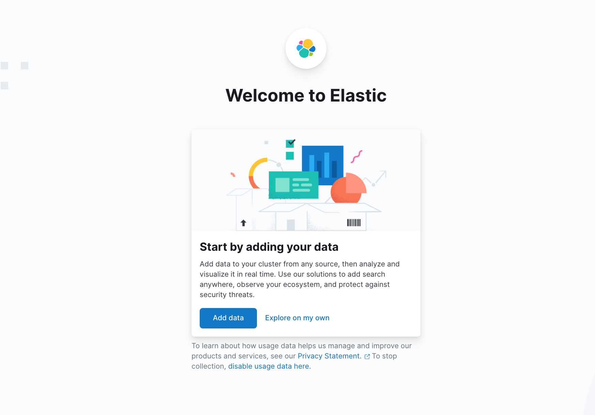
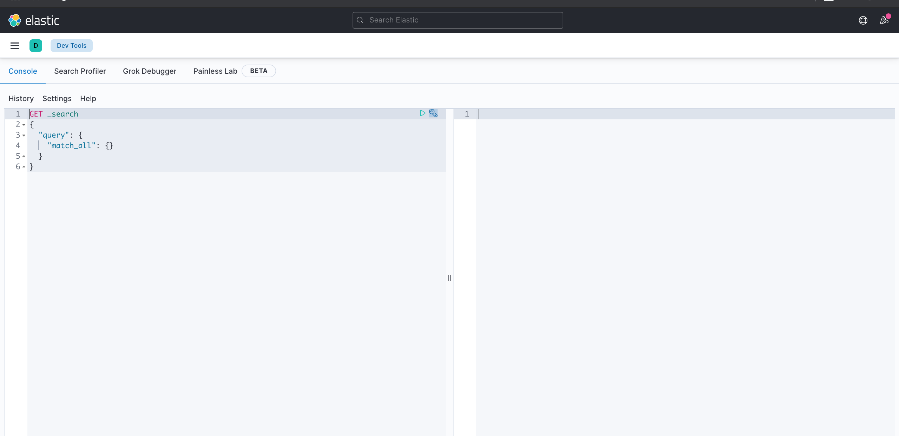

ELK utilizes the open source stack of 
1. Elasticsearch for deep search and data analytics; 
1. Logstash for centralized logging management, which includes shipping and forwarding the logs
from multiple servers, log enrichment, and parsing
Logstash helps build a data pipeline that can
centralize data processing. With the use of a variety of plugins for input and
output, it can convert a lot of different input sources to a single common format.
1.   Kibana for powerful and beautiful data visualizations. 
1.  Beats : Beats is a platform of open source lightweight data shippers. Its role is complementary to
Logstash. Logstash is a server-side component, whereas Beats has a role on the client side.
Beats consists of a core library, libbeat, which provides an API for shipping data from the
source, configuring the input options, and implementing logging. 
Beats is installed on machines that are not part of server-side components such as Elasticsearch, Logstash, or Kibana. These agents reside on non-cluster nodes, which are sometimes called edge nodes
1. X-Pack : X-Pack adds essential features to make the Elastic Stack production-ready. It adds security,monitoring, alerting, reporting, graph, and machine learning capabilities to the Elastic
Stack.
The monitoring component in X-Pack lets you monitor your Elasticsearch clusters and Kibana.


```text
- The Beats framework, Filebeat in particular, can run as a lightweight agent to
collect and forward logs.
- Logstash can centralize events received from Beats, and parse and transform each
log entry before sending it to the Elasticsearch cluster.
- Elasticsearch indexes logs. It enables both search and analytics on the parsed
logs.
- Kibana then lets you create visualizations based on errors, warnings, and other
information logs. It lets you create dashboards on which you can centrally
monitor events as they occur, in real time.
- With X-Pack, you can secure the solution, configure alerts, get reports, and
analyze relationships in data.
```


### Setting up locally
1. Download [Elastic search](https://www.elastic.co/downloads/elasticsearch)
```shell
tar -zxvf elasticsearch-{elastic_version}.tar.gz
cd elasticsearch-{elastic_version}
 bin/elasticsearch
 ```

 ```shell
curl 'http://localhost:9200/?pretty'
```

Output :
```shell
{
  "name" : "apples-Air-5",
  "cluster_name" : "elasticsearch",
  "cluster_uuid" : "wtc4SLclR-CATl8oR6Dg0g",
  "version" : {
    "number" : "7.14.0",
    "build_flavor" : "default",
    "build_type" : "tar",
    "build_hash" : "dd5a0a2acaa2045ff9624f3729fc8a6f40835aa1",
    "build_date" : "2021-07-29T20:49:32.864135063Z",
    "build_snapshot" : false,
    "lucene_version" : "8.9.0",
    "minimum_wire_compatibility_version" : "6.8.0",
    "minimum_index_compatibility_version" : "6.0.0-beta1"
  },
  "tagline" : "You Know, for Search"
}
```

2. Download [Kibana](https://www.elastic.co/downloads/kibana)
```shell
tar -zxvf kibana-{kibana_version}-darwin-x86_64.tar.gz
cd kibana-{kibana_version}
 bin/kibana
 ```
Open http://localhost:5601 in your favorite browser.


Kibana Console has an editor that allows you to interact with Elastic rich REST API
You can navigate to the Console by typing console on search button OR clicking on `Dev tool`
The Console is divided into two parts: the editor pane and the results pane.


